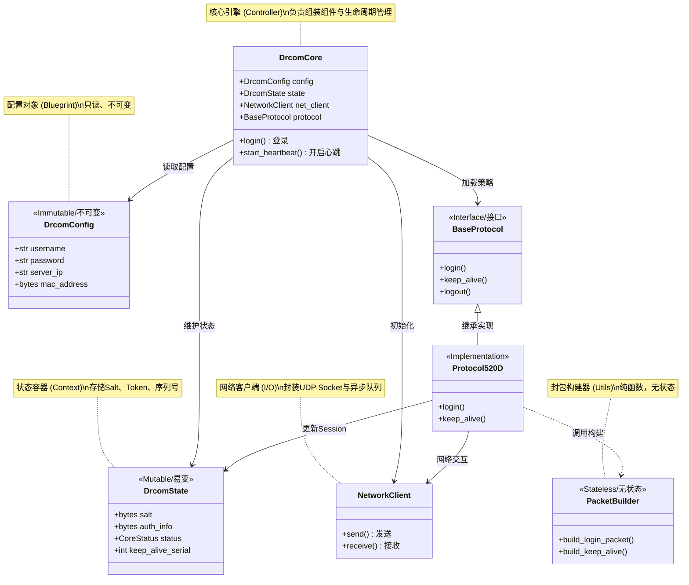
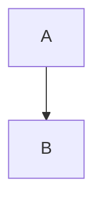

# Drcom-Core

[](LICENSE)
[](https://www.python.org/)
[](https://github.com/psf/black)

**Drcom-Core** 是一个基于 Python 3.13+ 构建的现代化 Dr.COM 认证协议核心库。

它采用了 **引擎 (Engine) + 策略 (Strategy)** 的解耦架构，旨在提供一个类型安全、零运行时依赖、易于扩展的底层认证框架。

> 🚧 **注意**：本项目专注于协议的核心实现，不包含 GUI 界面。开发者可基于此库构建 CLI 工具、系统服务或 OpenWrt 脚本。

## ✨ 核心特性

* 🐍 **纯粹 Python**: 仅依赖标准库，零第三方依赖，适合嵌入式环境。
* ⚡ **全异步 I/O**: 基于 `asyncio` 和 `Queue` 构建，高效处理并发与心跳维持。
* 🛡️ **健壮稳定**: 内置防广播风暴过滤、智能掉线重连及状态自动恢复机制。
* 🔧 **类型安全**: 100% Type Hints 覆盖，配合 Pydantic 风格的配置校验。

## 🏗️ 架构概览

Drcom-Core 通过将状态管理、网络传输与协议逻辑分离，实现了高度的模块化。

```mermaid
graph TD
    User([用户/上层应用]) -->|1. 初始化配置| Config[DrcomConfig]
    User -->|2. 控制指令| Core[DrcomCore 引擎]

    subgraph Internal ["Drcom-Core 内部架构"]
        Core -->|加载策略| Strategy[ProtocolStrategy]
        Core -->|维护状态| State[DrcomState]
        Core -->|网络I/O| Net[NetworkClient]

        Strategy -->|构建封包| Packets[PacketBuilder]
        Strategy -->|读写状态| State
        Strategy -->|收发数据| Net
    end

    Net -->|UDP| Server((认证服务器))
````

## 🚀 快速开始

### 1\. 安装

由于零依赖，您可以直接将源码集成到项目中，或通过 pip 安装：

```bash
pip install -e .
```

### 2\. 最小化示例

以下代码展示了如何加载配置、登录并启动后台心跳保活：

```python
import asyncio
import logging
from drcom_core import DrcomCore, load_config_from_toml, CoreStatus

# 配置日志
logging.basicConfig(level=logging.INFO)

async def main():
    # 1. 加载配置 (支持 TOML 或 环境变量)
    # 假设当前目录下有 drcom_config.toml
    config = load_config_from_toml("drcom_config.toml")

    # 2. 初始化引擎
    # 定义状态回调函数，实时感知掉线或错误
    def on_status_change(status: CoreStatus, msg: str):
        print(f"==> [状态变更] {status.name}: {msg}")

    core = DrcomCore(config, status_callback=on_status_change)

    try:
        # 3. 执行登录
        if await core.login():
            print("登录成功！启动心跳守护...")

            # 4. 启动后台心跳 (这将阻塞直到任务停止)
            await core.start_heartbeat()
        else:
            print("登录失败，请检查密码或网络。")

    except Exception as e:
        print(f"发生未捕获异常: {e}")
    finally:
        # 5. 优雅退出
        await core.stop()

if __name__ == "__main__":
    asyncio.run(main())
```

## ⚙️ 配置说明

您可以使用 TOML 文件或环境变量来配置核心。

### 推荐: `config.toml`

```toml
[drcom]
# --- 基础认证信息 ---
username = "your_username"
password = "your_password"
server_ip = "192.168.1.1"    # 认证服务器 IP
drcom_port = 61440           # 默认端口

# --- 网络参数 ---
bind_ip = "0.0.0.0"          # 本地绑定 IP
timeout_login = 5.0          # [New] 登录超时时间 (秒)
max_retries_busy = 3         # [New] 服务器繁忙重试次数

# --- 客户端指纹 (D版专用) ---
# 请抓包获取您学校的特定值，以下仅为示例
mac = "00:11:22:33:44:55"
host_ip = "192.168.1.100"
host_name = "Drcom-Client"
primary_dns = "8.8.8.8"
dhcp_server = "192.168.1.1"

# --- 协议特征值 (Hex 字符串) ---
# 这些值通常是固定的，除非学校升级了设备
os_info_hex = "9400000006000000..."
keep_alive_version = "dc02"
```

> **提示**: 所有的 Hex 字符串字段均支持自动去除 `0x` 前缀和空格。

## 🛡️ 异常处理

Drcom-Core 提供了精细的异常体系，建议在上层逻辑中分别处理：

  * **`AuthError`**: 认证被拒绝（密码错误、欠费）。**不要重试**，应提示用户检查账号。
  * **`NetworkError`**: 网络超时、端口占用。建议执行**指数退避重试**。
  * **`ConfigError`**: 配置文件缺失或格式错误（如非法字符）。

## 🤝 协议流程 (Sequence Diagram)

了解 Dr.COM 的 D 版协议交互流程有助于排查问题：



## ❤️ 致谢 (Credits)

  * 感谢 **drcom-generic** 社区的前辈们对协议逆向工程做出的贡献。
  * 感谢开源社区提供的 Python 现代化工具链支持。

-----

## ⚖️ License

本项目采用 **AGPL v3** 许可证。


