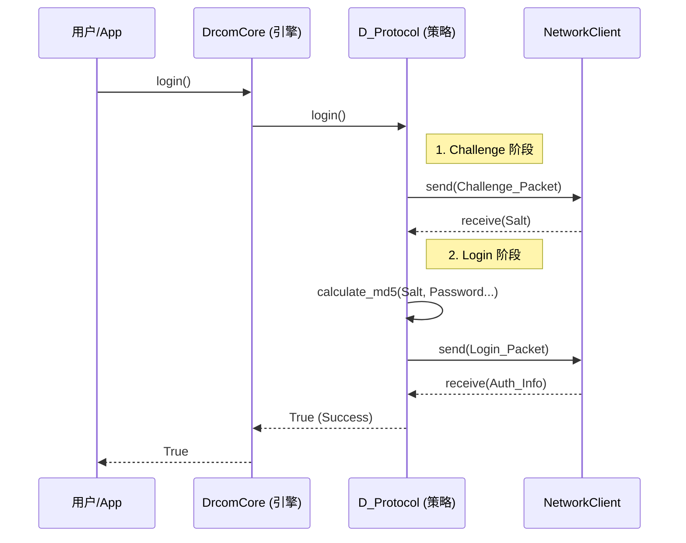

# 架构概览

`drcom-core` 的设计遵循 **高内聚、低耦合** 的原则，采用了 **引擎 (Engine) + 策略 (Strategy)** 模式。

这种设计使得我们在支持新的协议版本（如 P 版、X 版）时，无需修改核心逻辑，只需增加新的策略文件即可。

## 1. 核心分层

项目主要分为三层：

### 引擎层 (Engine Layer)
* **文件**: `src/drcom_core/core.py`
* **职责**:
    * 负责程序的生命周期管理（初始化、登录、保活、注销）。
    * 负责线程管理（心跳守护线程）。
    * 负责对外提供统一的 API。
* **特点**: 它不知道如何构建一个具体的 Dr.COM 数据包，它只知道调用策略层的接口。

### 策略层 (Strategy Layer)
* **文件**: `src/drcom_core/protocols/*.py`
* **职责**:
    * 实现具体的协议逻辑（如 `D_Protocol`）。
    * 决定何时发送 Challenge 包，何时计算 MD5。
    * 维护协议特定的状态机（如 D 版的 KeepAlive2 序列）。
* **特点**: 它是无状态的工具集合，本身不持有 Socket，也不直接操作网络。

### 基础设施层 (Infrastructure Layer)
* **Network**: `src/drcom_core/network.py` - 封装所有的 UDP Socket 操作。
* **State**: `src/drcom_core/state.py` - 单纯的数据容器，存储 Salt、Token 等会话状态。
* **Config**: `src/drcom_core/config.py` - 不可变的配置对象。

## 2. 数据流向 (Login 流程)

## 3. 关键设计决策
### IO 与逻辑分离:

* 所有的 Socket 操作仅存在于 `network.py`。

* 所有的协议包构建逻辑仅存在于 `protocols/` 下的纯函数中。

* 这使得我们可以轻松地对协议逻辑进行单元测试，而无需 Mock 复杂的网络环境。

### 不可变配置:

* `DrcomConfig` 使用 `@dataclass(frozen=True)` 定义。

* 这保证了配置在运行时不会被意外修改，增加了多线程环境下的安全性。

### 强类型:

* 全项目强制使用 Python Type Hinting。

* 这不仅是为了文档，更是为了利用 IDE 的静态分析能力，减少低级错误。
